## 動作確認

### 開始
```
docker compose up --build -d
```
### 再起動
```
docker compose restart
```
### 終了
```
docker compose down
```
## 開発時のURL

http://127.0.0.1:8080/

## アプリケーションの内容
1. **グループ構成**
    1. 1ユーザーにつき1グループまで所属可能
    2. 1グループ最大5人まで
    3. 参加方法:招待リンクによる知人との参加、またはランダムマッチング
2. **初期評価**
    1.  チーム組成後、生成AIが各ユーザーに現在の睡眠の質を10段階評価で尋ねる
    2. この初期評価は、ミッション実践後の睡眠の質との比較に使用される
3. **ミッションの設定**
    1. グループチャットで、生成AIが「昨夜はなにをしてから寝ましたか?」や「今日睡眠のために気を使ったことはなんですか?」といった睡眠に関する多種多様な回答が得られるような質問をする
    2. 生成AIは、グループメンバーの回答からランダムにトピックを抽出(例: 「逆立ち」「お酒」「ストレッチ」)
    3. 抽出したトピックに基づき、ミッションを設定
    4. ミッションは、睡眠の質向上に寄与する内容(例: 「寝る前1時間はリラックスできるストレッチをしてみましょう」)
4. **ミッション実践**
    1. ミッションは一週間を通じて行う
    2. 生成AIは毎朝、ユーザーに「昨夜はミッションを実施しましたか?」と尋ね、10段階評価で回答をもらう。また、適宜睡眠に関する知識を提供したり、ユーザーからの質問に答えるようにして、ユーザーのモチベーション維持をサポートする。
5. **評価とフィードバック**
    1. 一週間後、生成AIは再度「ミッションの内容を一週間実践した、今の睡眠の質を10段階評価で教えてください」と質問する
    2. 生成AIが一週間前の評価と直近の評価を比較し、各ユーザーに対して具体的なフィードバックを提供する。たとえば、睡眠の質が改善した要因や、改善しなかった場合の考察なども含める。
    3. ミッションの成否は、一週間の自己評価の総合点で判断する
6. **継続またはグループ退出**
    1. 一週間後、ユーザーはグループに残るか退出するかを選択できる
    2. 継続する場合、新しいミッションが設定される(手順2から再開)
## アプリのワークフロー

```mermaid
graph LR
    A[開始] --> AA[プライバシー\nポリシー表示]
    AA --> AB{ユーザーの同意}
    AB -->|同意しない| AC[アプリケーション\n利用不可]
    AC --> S[終了]
    AB -->|同意する| MM[メインメニュー]
    MM --> B[グループ作成]
    MM --> UP[ユーザー\nプロファイル確認]
    B --> C{グループ参加方法}
    C -->|招待リンク| D[知り合いを招待]
    C -->|ランダムマッチング| E[ランダムグループに参加]
    D --> F[グループ形成]
    E --> F
    F --> G[質問]
    G --> GA[ユーザーの回答]
    GA --> GB{回答の確認}
    GB -->|修正| GA
    GB -->|確定| H[トピック抽出]
    H --> I[ミッション設定]
    I --> J[ミッション実践]
    J --> K[毎日の進捗確認]
    K --> L{1週間経過?}
    L -->|No| K
    L -->|Yes| M[結果評価]
    M --> N[フィードバック提供]
    N --> O{グループ継続?}
    O -->|Yes| P[新ミッション]
    P --> G
    O -->|No| Q[グループ退出]
    Q --> R{再参加?}
    R -->|Yes| MM
    R -->|No| S
    
    style MM fill:#f9f,stroke:#333,stroke-width:4px,color:black
    style UP fill:#bbf,stroke:#333,stroke-width:2px,color:black
    style GB fill:#ffa,stroke:#333,stroke-width:2px,color:black
```

